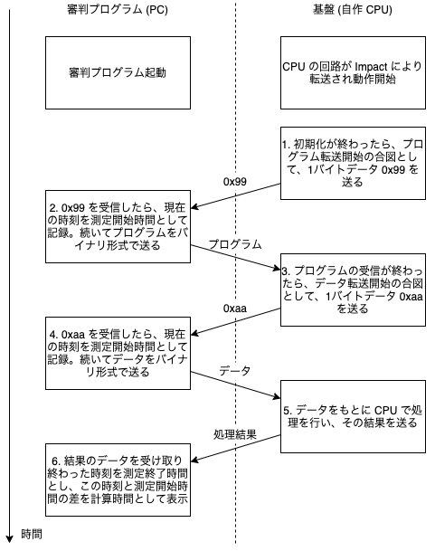

<!-- 
README.md
    `server.py` に関する説明資料です。
    内容はPDF版(README.pdf)からご覧ください。 
-->

# CPU 実験審判プログラム

`server.py` に関する説明資料です。

## 1. 全体の流れ



>［補足］
図中 `Impact` とあるのは、古のツールiMPACTのことであり、歴史的経緯からここに残っています。
ここでは、単にVivadoと読み替えてください。
また実際には、Vivadoから転送せずともボードに回路を書き込む方法も存在しています。詳しくは[Appendix](#bitファイルの書き込み)をご覧ください。


<div style="page-break-before:always"></div>

## 2.使い方

1. 必要なパッケージのインストール

    ```bash
    $ pip install -r requirements.txt
    ```

    >［補足］
    `requirements.txt` は必要なパッケージとバージョンの情報を記述しているだけのテキストファイルです。
    その他のパッケージ管理ツールを使用している場合は適宜そちらの使用方法に従ってこれらのパッケージをインストールしてください。

2. USB ポートの探索

    `*` はワイルドカードです。複数見つかったら総当たりして、`0x99` が送られてくるポートを探してください。

    - `Windows`: デバイスマネージャーを開いて UART と繋がっているポートを探す（`COM{1,2,3,4}` など）
    - `Ubuntu`: `$ ls /dev/tty*` などで探す（`/dev/ttyUSB0` など）
    - `Mac`: `$ ls /dev/tty.*` などで探す（`/dev/tty.usbserial*`、`/dev/tty.SLAB_USBtoUART` など）
        - 見つからない場合には[こちらのページ][macOS-FTDI] などを参考にドライバを入れると見つかるはずです（[Appendix](#macとfpgaボードの通信)に具体的な手順があるので、先にご覧ください）
        - 入れるドライバは [FTDI][FTDI-VCP] や [Silicon Labs CP2105GM][Silicon-Lab-CP2105GM] などからボード側のポートに合わせて適切なものを選んでください （`Nexys A7` なら `FTDI`、`KCU 105` なら `Silicon Lab` のはず）


3. コマンドの実行

    ```bash
    $ python server.py <port>
    ```

    オプションについては次の章を参照


<div style="page-break-before:always"></div>

## 3. オプション

| オプション          | <nobr>略称</nobr> | <nobr>デフォルト値</nobr>  | 説明 |
| :-----------------| :--- | :---------- | :--- |
| `port`            |      |             | UART の繋がっているポートのフルネームを指定。（Windows: `COM3`、 Ubuntu: `/dev/ttyUSB*`、 Mac: `/dev/tty.usbserial*` など）|
| `--program`       | `-p` | None        | CPU で実行するプログラムのバイナリファイルを指定。指定しない場合は "1. 全体の流れ" の手順 1 と 2 は省略。 |
| `--data`          | `-d` | contest.sld | CPU に送るデータのファイルを指定。`.sld` は SLD データとして、`.txt` は空白改行区切りの単精度浮動小数点型データとして、残りはバイナリとして読み込む。 |
| `--output`        | `-o` | output      | 受け取ったデータを保存する際の名前を指定。`--raw_output` が指定されない時は PPM 画像を受け取ると解釈して、`.txt`、`.ppm`、`.png` ファイルを生成する。指定された時はバイナリファイルを生成する。 |
| `--raw_output`    |      | None        | 受け取るバイト数を自然数で指定。 |
| <nobr>`--one_byte_each`</nobr> |  | False | 1 バイトずつ読み込んで PPM をパース。コメントアウトや余分な余白などを含む PPM をパースできるが、**`baudrate` が大きい場合に受信バッファがオーバーフローしてビットをロストする可能性がある**ことに注意。コメントアウトや余分な空白を出力しないようにして、このオプションを外すことを推奨。 |
| `--max_n_bytes`   |      | 1024        | 何バイトずつ読み込むかを指定。 |
| `--baudrate`      |      | 115200      | ボーレートを自然数で指定。 |
| `--endian`        | `-e` | little      | 'little' か 'big' を指定。 |
| `--parity`        |      | none        | 'none'、'odd'、'even'、'mark'、'space' のいずれかを指定。 |
| `--stopbits`      |      | 1           | '1'、'1.5'、'2' のいずれかを指定。 |
| `--no_progress`   |      | False       | パケットを受け取るときのプログレスバーを表示するか指定。 |

`--parity` と `--stopbits` に関しては pySerial の [serial.Serial][pyserial] に準拠。


<div style="page-break-before:always"></div>

## 4. 各データのフォーマット

シリアル通信をするとき各データは以下のような形で送られる。

### プログラム

- 読み取ったバイナリの前に、その読み取ったバイナリのバイト数を付加して送る
- バイト数は、int として解釈し、エンディアンに従って、4バイトでエンコードされる

### SLD ファイル

- int、float 両方のデータが存在するが、共にエンディアンに従って、4バイトでエンコードして送る
- データ間の空白などはなし
- 何バイト受け取るかはプログラムが判断するので、送るバイト数は付加しない

### テキストファイル

- 全て float と解釈して読み取って、エンディアンに従って、4バイトでエンコードして送る
- データ間の空白などはなし
- 何バイト受け取るかはプログラムが判断するので、送るバイト数は付加しない

### バイナリファイル

- 読み取ったバイナリをそのまま送る
- 何バイト受け取るかはプログラムが判断するので、送るバイト数は付加しない

### PPM 画像

- P3（text 形式）か P6（binary 形式）のいずれかのフォーマットを認識して受け取る
- デフォルトは P3 で、わざわざ P6 に変える必要はあまりないと思われる
- 後ろに余計なデータが付いていた場合は無視される
- `25` を P3 では `\x30\x32\x35` (= `025`) のように一文字ずつバイナリに変換して送るが、P6 では `\x19` のように RGB 値を1バイトで表現して送る
- **`--one_byte_each` をつけない時の仕様**
    - コメントアウトや余分な空白が来ないことを期待している
    - PPM の仕様としては `25`、`025`、`s25`（`s` は半角スペースを表す）のどの形式でも解釈できるが、文字数を合わせるように `025`、`s25` のどちらかの形式を期待している
- 詳しく知りたい方はググってください（~~知らなくても大丈夫~~）

### 注意

- `output.*` や `raytrace` は実験のために使ったサンプルなので、結果がこれと全く同じになるとは限りません


<div style="page-break-before:always"></div>

## 5. Appendix

### MacでCPU実験

MacでNexys A7-50T（2021年度から使用しているFPGAボード）の実機動作確認をする手順を参考までに記す。
>［背景と動機］
>- （2023年度時点において）学科PCはWindows機であるが、個人ではMacを所有する人も多く存在しており、Macを用いてFPGAボードでの動作確認ができることには一定のメリットがある。
>- しかし、Macを利用する場合、Vivadoを用いてFPGAボードに `Program Device` を行うのは困難である。さらに、ボードとの通信においても困難に遭遇する可能性がある。
>- また、ハードウェア設計担当者に限らず、シミュレータやコンパイラの実装を検証するためにFPGAボードを利用したいケースは存在する。だが、そうした場合に逐一Vivadoを起動するのは面倒である。
>- そこで、代替となる作業フローについて参考までに記しておく。

大枠としては、以下のようなフローとなる。
1. bitファイルをUSBフラッシュメモリ/microSDカードに書き込み、それをFPGAボードに挿入する。（A7-50Tで利用可能な、`Program Device` の代替手段。Macの利用に限らず、回路の更新が不要な場合にも便利。）
1. MacとFPGAボードをUSBケーブルで接続する。
1. （プログラムを実行する。）

<!-- それぞれ以下に補足を記す。 -->

#### bitファイルの書き込み

リファレンスマニュアルの [USB Host and Micro SD Programming][nexysA7-usb] を参照。
以下の作業が必要となるはず。
- FPGAボードのジャンパをいじって、ボードの設定を変更する。
- 記憶媒体をフォーマットし、目的の回路に対応したbitファイルを１つだけ書き込む。

#### MacとFPGAボードの通信

基本的にはFPGAボードに接続したUSBケーブルの他端をMacに接続するだけなのだが、このとき適切なUSBポートが `$ ls /dev/tty.*` で見つからない場合がある。（複数見つかったら総当たりで試せばよい。）

これは、（少なくとも2024年3月時点において）最近のmacOSでは、標準のFTDI用VCPドライバがうまく動作しないという[問題][macOS-FTDI]が原因であることが疑われる。
そこで、手動でドライバをインストールして問題の回避を試みる。
1. FTDIの[VCPドライバのページ][FTDI-VCP]にアクセスする。
1. OSとアーキテクチャから適切なバージョンを選択し、ダウンロードする。
    - Apple Silicon（`M1` など）はARMの列を参照する。ちなみに、このアーキテクチャに対応するOSは macOS 11 (Big Sur) 以降である。
    <!-- ちなみに、そもそも macOS という表現自体が、長く続いた OS X (10) のあとのメジャーバージョン番号11以降を意味している。 -->
    - OSの行は `Mac OS X10.15 and macOS 11/12` が最新となっているが、macOS 13 (Ventura) でも実行できることを確認できた。
1. ディスクイメージからドライバをインストールする。

#### プログラムの実行

`server.py` の実行コマンドは、開発するプロセッサによってまちまちである。
他者にデバッグを依頼するときや、レポートで実行方法について説明するときなどは、必ず**実行コマンドに関する情報を含めるべき**だろう。


<div style="page-break-before:always"></div>

## 6. ChangeLog

- v1.0 (2021/10/02)
    - C 言語で書かれた過去のサーバを Python に移植
    - Windows 以外に Ubuntu、Mac でも動作することを確認
- v1.1 (2021/12/26)
    - v1.0 では 1 バイトずつ読み込んでいたものを 1024 バイトずつ読み込むように修正し、受信バッファのオーバーフローを回避
    - コメントアウトや余分な余白などを含む PPM はパースできない状態に変更
    - `--one_byte_each` オプションをつけることで v1.0 の動作も再現
- v1.2 (2022/01/09)
    - 1024 バイトずつ読み込むときに余分に for ループが回るバグを修正
- v1.3 (2022/02/14)
    - 何バイトずつ読み込むかを指定できるオプション `--max_n_bytes` を追加
    - `--one_byte_each` をつけない時に 0 埋めだけでなく、スペース埋めで 3 桁に揃える形式もサポート
- v1.4 (2022/03/03)
    - `tqdm` のバグを修正
<!-- 以下2023年度TAによる変更（PDFはVSCodeの`Markdown PDF`拡張で生成） -->
- v1.5 (2024/03/10)
    - Appendixを追加
        - Macから実機動作確認を行う方法に関する記述を追加
    - 「全体の流れ」に関する補足を追加
    - 「必要なパッケージのインストール」に関する補足と「USBポートの探索」に関する記述を追加
    - 読みやすさのため章間にページ区切りを挿入
    - （そのほかMarkdownファイル全体の修正＆いくつかのコメントを追加）

<!-- 参考URL -->
[macOS-FTDI]:http://blueeyes.sakura.ne.jp/2021/06/17/4045/
[FTDI-VCP]:https://ftdichip.com/drivers/vcp-drivers/
[Silicon-Lab-CP2105GM]:https://jp.silabs.com/developers/usb-to-uart-bridge-vcp-drivers
[pyserial]:https://pyserial.readthedocs.io/en/latest/pyserial_api.html
[nexysA7-usb]:https://digilent.com/reference/programmable-logic/nexys-a7/reference-manual#usb_host_and_micro_sd_programming
